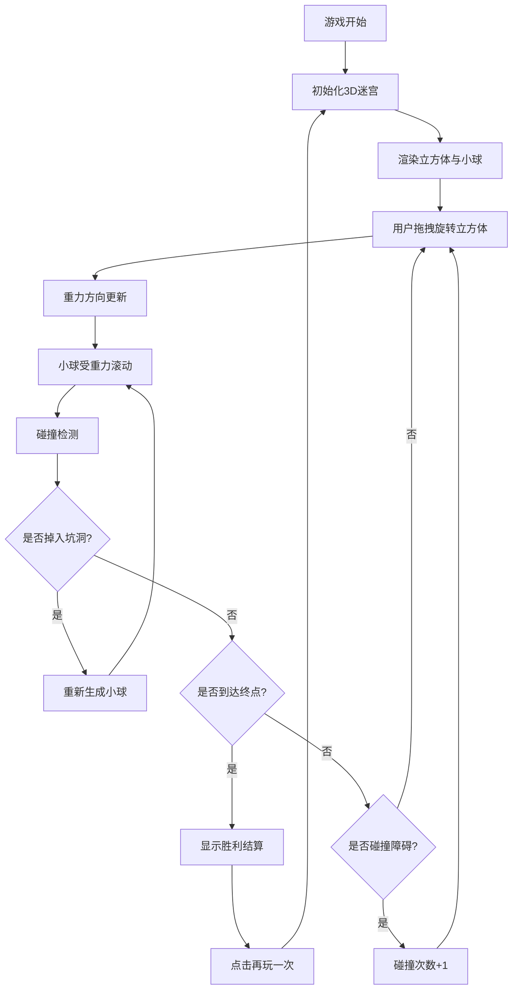

## 1. 产品概述

3D立方体迷宫是一款基于重力机制的益智解谜游戏，玩家通过旋转立体迷宫方块，利用重力引导小球穿越复杂的三维迷宫到达终点。游戏融合了空间想象力与物理直觉，为玩家带来独特的沉浸式体验。

- **核心玩法**：旋转立方体改变重力方向，引导小球避开障碍物和坑洞到达终点
- **目标用户**：喜欢解谜、益智类游戏的玩家，适合全年龄段
- **市场价值**：创新的3D重力机制，提供不同于传统2D迷宫的独特体验

## 2. 核心功能

### 2.1 功能模块

1. **游戏主界面**：3D迷宫渲染、小球物理模拟、实时交互
2. **状态显示**：计时器、碰撞次数统计、游戏状态提示
3. **控制交互**：鼠标/触摸拖拽旋转、重新开始按钮
4. **胜利判定**：到达终点检测、结算界面

### 2.2 页面详情

| 页面名称 | 模块名称 | 功能描述 |
|-----------|-------------|---------------------|
| 游戏主页面 | 3D场景渲染 | 实时渲染透明立方体迷宫、内部墙壁、障碍物、坑洞和小球 |
| 游戏主页面 | 物理引擎 | 重力模拟、碰撞检测、小球滚动动画 |
| 游戏主页面 | 交互控制 | 鼠标/触摸拖拽旋转立方体，支持桌面和移动端 |
| 游戏主页面 | 状态面板 | 显示经过时间、碰撞次数、操作提示 |
| 游戏主页面 | 控制按钮 | 重新开始按钮、视角重置按钮 |
| 结算弹窗 | 胜利界面 | 显示完成时间、碰撞次数，提供再玩一次选项 |

## 3. 核心流程

## 4. 用户界面设计

### 4.1 设计风格
- **主色调**：深邃太空蓝 `#0a1628` 作为背景，搭配霓虹青 `#00f5ff` 作为高亮
- **辅助色**：金属银 `#c0c0c0` 用于迷宫结构，警示红 `#ff4757` 用于坑洞，胜利绿 `#2ed573` 用于终点
- **按钮风格**：玻璃拟态（Glassmorphism），半透明背景配模糊效果，圆角12px
- **字体**：标题使用 Orbitron 科技感字体，正文使用 JetBrains Mono 等宽字体
- **布局风格**：全屏3D场景居中，状态面板悬浮于左上角，控制按钮悬浮于右上角
- **视觉特效**：立方体边缘发光、小球拖尾效果、轻微Bloom泛光

### 4.2 页面设计概述

| 页面名称 | 模块名称 | UI Elements |
|-----------|-------------|-------------|
| 游戏主页面 | 3D场景 | 半透明玻璃立方体、金属质感墙壁、发光终点标记、警示红色坑洞 |
| 游戏主页面 | 状态面板 | 黑色半透明背景、青色发光数字、图标+数据布局 |
| 游戏主页面 | 控制按钮 | 玻璃拟态按钮、悬停放大效果、点击反馈动画 |
| 结算弹窗 | 胜利界面 | 居中弹窗、庆祝动画、统计数据展示、渐变按钮 |

### 4.3 响应设计
- **桌面端优先**：鼠标拖拽旋转，滚轮可缩放视角
- **移动端适配**：触摸拖拽支持，自动适应屏幕尺寸，按钮尺寸优化
- **触摸优化**：增大可点击区域，支持多指操作

### 4.4 3D场景指导

#### 环境与氛围
- **背景**：深邃的渐变夜空蓝，点缀微弱的星点粒子效果
- **HDRI**：使用冷色调环境贴图，模拟科技感空间氛围

#### 光照设置
- **主光源**：冷白色方向光，模拟环境光
- **点光源**：终点处放置绿色发光点光源，坑洞放置红色点光源
- **环境光**：低强度蓝色环境光，确保暗部细节可见
- **阴影**：启用柔和阴影，增强空间感

#### 相机设置
- **初始视角**：透视相机，45度俯视角，距离立方体中心3-4个单位
- **相机运动**：支持轨道控制缩放，拖拽时相机与立方体同步旋转

#### 构图与焦点
- **主体**：立方体迷宫居中，占据画面60%空间
- **视觉引导**：终点发光、小球拖尾效果引导玩家视线
- **层次**：透明立方体外壳 → 内部墙壁结构 → 滚动小球

#### 交互与动画
- **立方体旋转**：缓动函数插值，平滑跟随鼠标/触摸移动
- **小球运动**：基于物理的真实滚动，碰撞时轻微反弹
- **胜利动画**：立方体发光脉冲，小球爆发粒子效果
- **UI动画**：状态变化时数字跳动，按钮悬停微动效

#### 后期处理
- **Bloom泛光**：轻微的泛光效果，突出发光元素
- **抗锯齿**：FXAA抗锯齿，保证边缘平滑
- **色调映射**：ACES电影级色调映射

#### 资源与性能
- **几何体**：全部使用程序化生成，无外部模型依赖
- **性能预算**：目标60fps，Draw call控制在50以内
- **材质**：使用标准PBR材质，减少Shader复杂度

