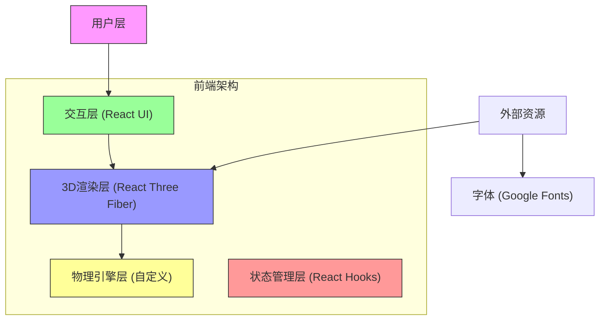

## 1. 架构设计



## 2. 技术描述

### 2.1 核心技术栈
- **前端框架**：React@18 + TypeScript
- **构建工具**：Vite@5
- **样式方案**：TailwindCSS@3
- **3D渲染引擎**：Three.js
- **React 3D绑定**：@react-three/fiber@8
- **3D辅助组件**：@react-three/drei@9
- **后期处理**：@react-three/postprocessing@2

### 2.2 技术选型说明
1. **@react-three/fiber**：React声明式Three.js封装，便于组件化开发3D场景
2. **@react-three/drei**：提供常用3D组件（相机控制、文字、天空等）
3. **自定义物理引擎**：由于游戏物理规则特殊（重力方向可变），实现轻量级自定义物理系统
4. **TailwindCSS**：快速构建响应式UI界面

## 3. 目录结构

```
src/
├── components/
│   ├── game/
│   │   ├── MazeCube.tsx        # 3D立方体迷宫组件
│   │   ├── Ball.tsx            # 小球组件
│   │   ├── Walls.tsx           # 墙壁组件
│   │   ├── Pit.tsx             # 坑洞组件
│   │   └── Goal.tsx            # 终点组件
│   └── ui/
│       ├── StatusPanel.tsx     # 状态面板
│       ├── ControlButtons.tsx  # 控制按钮
│       └── VictoryModal.tsx    # 胜利弹窗
├── hooks/
│   ├── useGameState.ts         # 游戏状态管理Hook
│   ├── usePhysics.ts           # 物理引擎Hook
│   └── useDragRotation.ts      # 拖拽旋转Hook
├── utils/
│   ├── mazeGenerator.ts        # 迷宫生成算法
│   ├── constants.ts            # 游戏常量配置
│   └── types.ts                # TypeScript类型定义
├── App.tsx
├── main.tsx
└── index.css
```

## 4. 核心模块设计

### 4.1 游戏状态类型

```typescript
// types.ts
export interface GameState {
  status: 'idle' | 'playing' | 'won';
  elapsedTime: number;
  collisionCount: number;
  ballPosition: Vector3;
  cubeRotation: { x: number; y: number };
  gravityDirection: Vector3;
}

export interface MazeCell {
  x: number;
  y: number;
  z: number;
  type: 'empty' | 'wall' | 'pit' | 'goal' | 'start';
}

export interface BallPhysics {
  position: Vector3;
  velocity: Vector3;
  radius: number;
}
```

### 4.2 物理引擎核心

```typescript
// usePhysics.ts
// 重力加速度 (m/s²)
const GRAVITY = 15;
const FRICTION = 0.92;
const BOUNCE_DAMPING = 0.3;

// 每帧更新小球位置
function updatePhysics(
  ball: BallPhysics,
  gravityDir: Vector3,
  walls: Wall[],
  pits: Pit[],
  dt: number
): { hitWall: boolean; fellInPit: boolean; reachedGoal: boolean }
```

### 4.3 迷宫数据结构

迷宫使用 5×5×5 的三维网格，每个格子可以是：
- `empty`：可通行区域
- `wall`：墙壁障碍
- `pit`：坑洞（掉落则重置）
- `goal`：终点
- `start`：起点

### 4.4 旋转控制

- 鼠标/触摸水平拖动 → 绕Y轴旋转
- 鼠标/触摸垂直拖动 → 绕X轴旋转
- 旋转使用四元数插值，实现平滑过渡
- 重力方向根据立方体旋转实时计算

## 5. 性能优化策略

1. **InstancedMesh**：使用实例化渲染批量绘制墙壁和坑洞
2. **固定时间步长**：物理更新使用固定60fps，与渲染帧率分离
3. **碰撞检测优化**：使用空间网格划分，减少碰撞检测对数
4. **材质复用**：相同类型的物体共享材质实例

## 6. 状态管理

使用 React Hooks + useReducer 管理游戏状态：
- `useGameState`：封装游戏逻辑和状态更新
- 状态变更触发3D场景重渲染
- 胜利/失败状态触发UI弹窗

